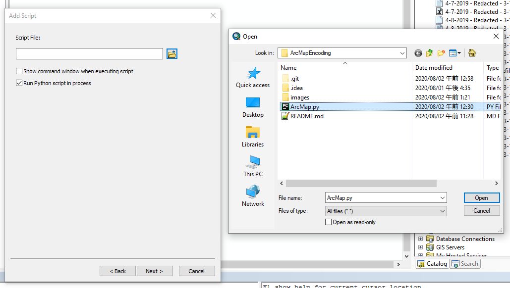

# police-data-geocoding
Script for ArcMap for geocoding police data locations as part of a project with UCLA economics professors.

## Installation in ArcMap
1. If you don't have the Catalog window open, go to **Windows** -> **Catalog** to open it, as it will be very useful for accessing the script.
2. In the Catalog window, navigate to **Toolboxes** -> **MyToolboxes**. If you don't already have a toolbox, right-click on MyToolboxes and navigate to **New** -> **Toolbox**, which will create al Toolbox.tbx file.  

3. Right-click that new Toolbox.tbx file in, navigate to **Add** -> **Script...**  

4. Set a name and description for this script, if you so desire, then click next.  

5. On the next screen, click the little folder icon next to the **Script File** field to open a file selector dialogue where you should select this file (ArcMap.py). Then click next.  

6. Now you will have to set the script parameters. I really wish there was an easy way for me to export this somehow so I don't have to update these instructions, but either way, this part is really important. You have to set these options exactly as I have them set, otherwise the script won't work.  

  
The most important thing other than what's shown here that the parameters **Address or LatLon** and **Table** should be set to required (and the rest set to optional), and for the parameters **X Coord** and **Y Coord**, the property "Filter" should be set to **Value List** (essentially a dropdown menu).  

7. Once the parameters are set, head over to the **Validation** tab at the top. You should see some Python code in a big window. Click the **Edit...** button below that window, and a notepad with that code will open.
8. Copy the code from [Validator.py](Validator.py) into this notepad, and save.
9. Close the notepad, and the code you just pasted should appear in that window.
10. Click OK at the bottom of the dialogue.

## Running the Script
In order to run an ArcMap script, simply navigate to where you imported it (if you followed the previous instructions, it will be in the Catalog window under Toolboxes -> My Toolboxes -> Toolbox.tbx -> *Script Name*).